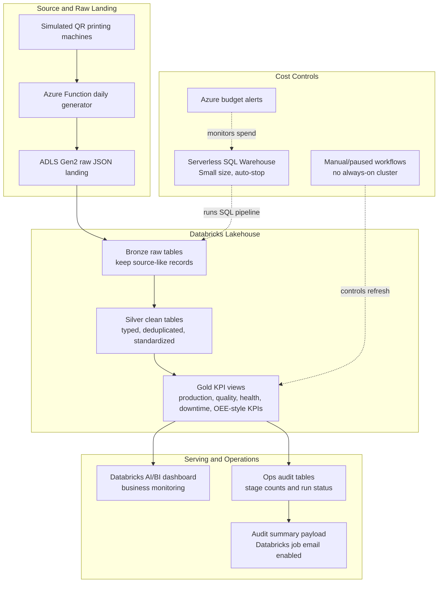

# Industrial QR Printing Lakehouse on Azure Databricks

This project demonstrates a low-cost Azure Databricks lakehouse for a QR printing production line. It turns raw machine JSON into Bronze, Silver, and Gold analytics tables, then uses Gold KPI views for operational dashboards and pipeline monitoring.

Live Databricks links are intentionally not included because the workspace, dashboard, and SQL assets require authenticated access.

## Business Objective

Manufacturing teams need fast visibility into production output, QR readability, machine health, downtime, and reject risk. This project simulates that operating environment and shows how a small lakehouse can preserve raw machine data, transform it into trusted KPI layers, and support dashboard reporting.

The key questions answered are:

- Are machines producing the expected volume?
- Are QR codes readable and printed with acceptable quality?
- Which machines show reject, downtime, or health issues?
- Did the daily pipeline add new raw, Bronze, Silver, and Gold data successfully?

## Architecture

Current working path uses Databricks Serverless SQL for the medallion pipeline and dashboard refresh. The original PySpark notebook workflow is prepared, but the tested Azure region could not acquire VM capacity for the Databricks job cluster during testing.

## Tech Stack

- Azure Databricks
- Databricks SQL Warehouse, Serverless, Small size, auto-stop enabled
- Unity Catalog style catalog/schema/table organization
- Delta-style Bronze, Silver, and Gold lakehouse layers
- ADLS Gen2 for raw JSON landing and reprocessing
- Azure Function Consumption plan for daily raw JSON generation
- Databricks Workflows / Jobs for scheduled refresh
- Databricks AI/BI Dashboard for KPI presentation
- SQL, Python, shell scripts, Azure CLI, Databricks CLI
- Azure Budget alerts and email-ready pipeline monitoring

## Databricks Screenshots

### Dashboard Asset

### Gold KPI Table

### SQL Warehouse Cost Control

### Workflow Jobs

## Current Status

Working:

- Raw QR printing JSON generation
- ADLS Gen2 raw landing pattern
- Bronze, Silver, and Gold SQL pipeline using real generated daily JSON
- Gold KPI views for production, quality, machine health, downtime, and OEE-style reporting
- Databricks dashboard asset
- Serverless SQL Warehouse with auto-stop
- Databricks workflow/job definitions
- Pipeline audit tables and email-ready alert payload
- Daily Serverless SQL workflow success/failure email notification
- Real-data Serverless SQL test run with 2,880 print events, 1,440 telemetry rows, and 67 log rows
- Azure Function daily generator deployment path

Prepared but blocked:

- PySpark notebook workflow on Databricks job cluster
- Blocker: VM acquisition stayed pending in Southeast Asia during testing

## Repository Map

- `notebooks/` - PySpark Bronze, Silver, and Gold notebooks
- `sql/` - Serverless SQL bootstrap, dashboard queries, and audit monitoring SQL
- `scripts/` - local generation, ADLS upload, Databricks SQL runner, and Azure Function deployment helpers
- `azure_function/` - Consumption-plan Function App code for daily raw JSON generation
- `docs/` - detailed implementation notes and learning material
- `docs/screenshots/` - Databricks UI screenshots for GitHub presentation

## Deep Dive Docs

- [Implementation details](docs/project_implementation_details.md)
- [Azure resources](docs/azure_resources.md)
- [KPI definitions](docs/kpi_definitions.md)
- [Alerting and monitoring](docs/alerting_monitoring.md)
