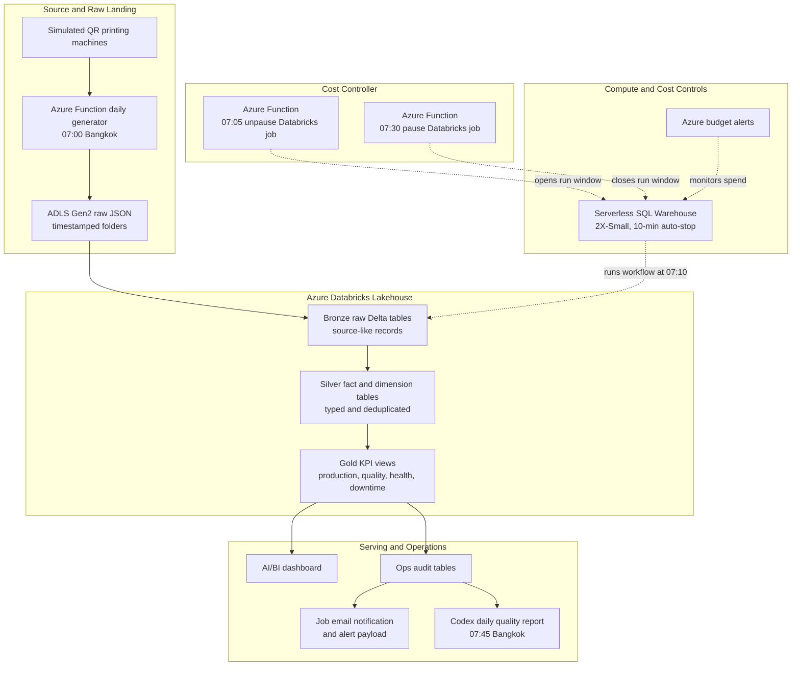
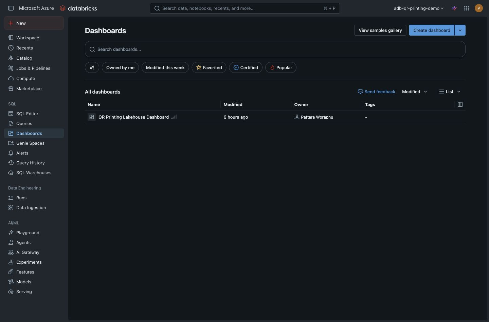
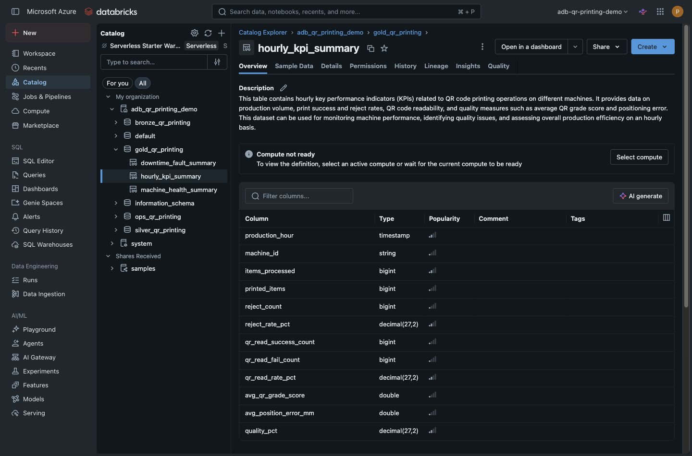
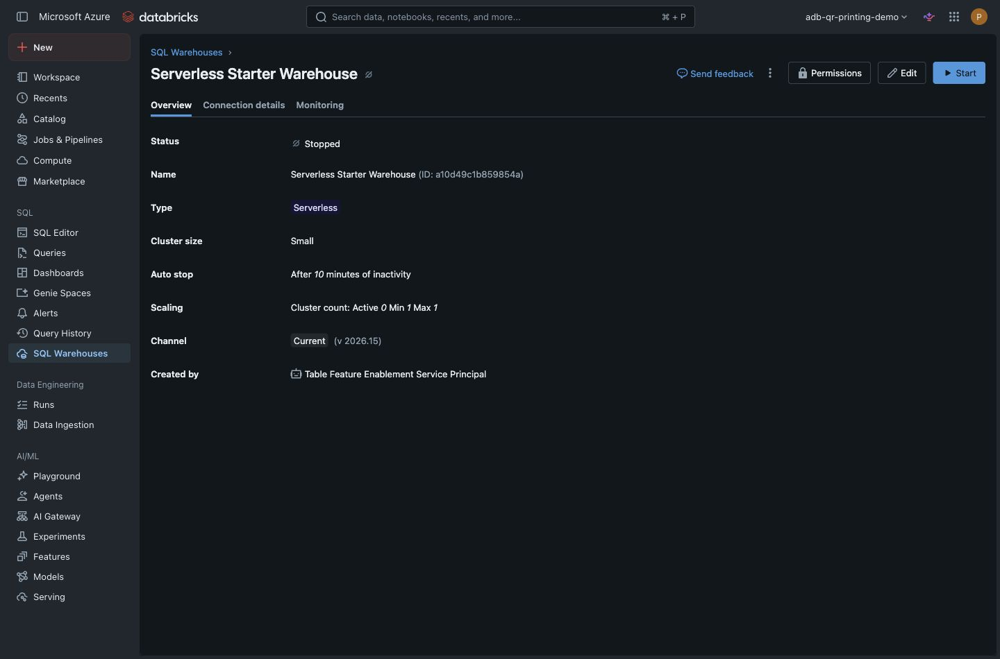
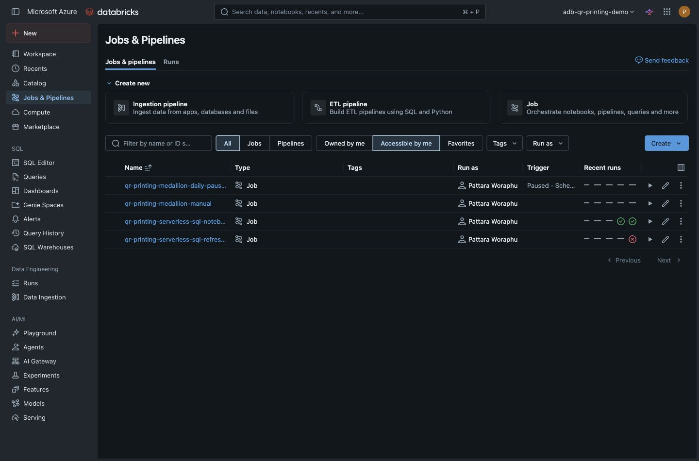

# Industrial QR Printing Lakehouse on Azure Databricks

A cost-controlled Azure Databricks lakehouse project for an industrial QR printing production line. The project simulates machine JSON output, lands it in ADLS Gen2, incrementally builds Bronze and Silver Delta tables with Serverless SQL, exposes Gold KPI views, and refreshes a Databricks AI/BI dashboard with daily run monitoring.

The main design goal is practical: show a credible medallion analytics workflow while keeping cloud compute tightly controlled.

Live Databricks links are intentionally not included because the workspace, dashboard, and SQL assets require authenticated access.

## What This Shows

- A realistic manufacturing analytics scenario using QR print events, machine telemetry, and fault logs.
- A Bronze, Silver, Gold lakehouse structure on Azure Databricks.
- Incremental `MERGE`-based SQL refresh instead of rebuilding the main tables every run.
- Daily ADLS-to-Databricks orchestration with an Azure Function cost controller.
- Dashboard-ready KPIs for production output, QR quality, machine health, downtime, and OEE-style monitoring.
- Operational audit tables, email-ready pipeline summaries, and a daily quality-check automation.

## Business Questions

The dashboard and Gold views are designed to answer:

- Are machines producing the expected volume?
- Are QR codes readable and printed with acceptable quality?
- Which hours show higher reject, unreadable QR, or downtime risk?
- Are printhead temperature, vibration, and speed trends healthy?
- Did the daily pipeline add new ADLS, Bronze, Silver, and Gold data successfully?

## Current Verified Result

Latest verified Serverless SQL workflow run:

| Area | Result |
|---|---:|
| Databricks workflow run | `536209218276513` |
| Bronze print events | `11,520` |
| Bronze telemetry rows | `5,760` |
| Silver print events | `11,520` |
| Gold hourly KPI rows | `96` |
| Latest production hour | `2026-06-20T06:00:00.000` Bangkok time |
| SQL Warehouse state after validation | `STOPPED` |

The PySpark notebook workflow is prepared but not the active path because the tested Databricks job cluster sizes could not be acquired in Azure Southeast Asia during setup. The working path uses Databricks Serverless SQL Warehouse.

## Architecture



## Daily Operating Flow

| Time, Bangkok | Step | Purpose |
|---|---|---|
| 07:00 | Azure Function writes QR JSON to ADLS | Create the daily raw source payload |
| 07:05 | Azure Function unpauses Databricks job | Open a short run window |
| 07:10 | Databricks Serverless SQL workflow runs | Refresh Bronze, Silver, Gold, dashboard, and audit tables |
| 07:30 | Azure Function pauses Databricks job | Prevent all-day scheduled compute wakeups |
| 07:45 | Codex quality report runs | Summarize source-to-Databricks validation and cost safety |

Normal expected state outside the morning window:

```text
Databricks job: PAUSED
SQL Warehouse: STOPPED
```

## Validation Strategy

Primary validation is the cloud data flow:

```text
scheduled Azure Function JSON in ADLS
→ Databricks Bronze
→ Databricks Silver
→ Databricks Gold
```

The daily quality report checks row counts, latest business date, duplicate keys, null critical keys, and whether Gold aggregates line up with Silver detail totals.

## Tech Stack

- Azure Databricks
- Databricks SQL Warehouse, Serverless, 2X-Small, 10-minute auto-stop
- Unity Catalog catalog/schema/table organization
- Delta-style Bronze, Silver, and Gold layers
- Databricks AI/BI dashboard
- ADLS Gen2 raw landing
- Azure Function Consumption plan for raw generation and Databricks pause/unpause control
- Managed identity and Databricks service principal permission scoped to the daily job
- Azure CLI, Databricks CLI, SQL, Python, shell scripts

## Repository Map

| Path | Purpose |
|---|---|
| `azure_function/` | Azure Function generator and Databricks pause/unpause controller |
| `sql/` | Serverless SQL medallion refresh, dashboard queries, and audit monitoring |
| `notebooks/` | Prepared PySpark Bronze/Silver/Gold notebooks |
| `scripts/` | Deployment, data generation, upload, and Databricks helper scripts |
| `docs/` | Implementation details, Azure resources, KPI definitions, and monitoring notes |
| `docs/screenshots/` | Databricks UI screenshots for portfolio review |

## Screenshots

### Databricks Dashboard Asset



### Gold KPI Table



### SQL Warehouse Cost Control



### Workflow Jobs



## Cost Controls

The project avoids always-on Databricks compute:

- The Serverless SQL Warehouse is `2X-Small` with 10-minute auto-stop.
- The Databricks workflow is normally `PAUSED`.
- Azure Function opens the Databricks job window only from 07:05 to 07:30 Bangkok.
- Azure budget alerts are documented for Databricks-focused spend monitoring.

This matters because SQL Warehouse auto-stop only stops compute after work has started. Pausing the Databricks job prevents the schedule from waking compute in the first place.

## Important Design Notes

- Bronze keeps source-like raw event, telemetry, and log rows.
- Silver contains fact and dimension tables.
- Gold contains aggregation views for dashboard reporting.
- Business timestamps are stored as Bangkok-local `TIMESTAMP_NTZ` to make SQL results easier to inspect.
- Main Bronze and Silver tables are protected with `CREATE TABLE IF NOT EXISTS` and updated with `MERGE`.
- Gold remains view-based, so dashboard logic stays simple and low maintenance.

## Deep Dive Docs

- [Implementation details](docs/project_implementation_details.md)
- [Azure resources](docs/azure_resources.md)
- [KPI definitions](docs/kpi_definitions.md)
- [Alerting and monitoring](docs/alerting_monitoring.md)
